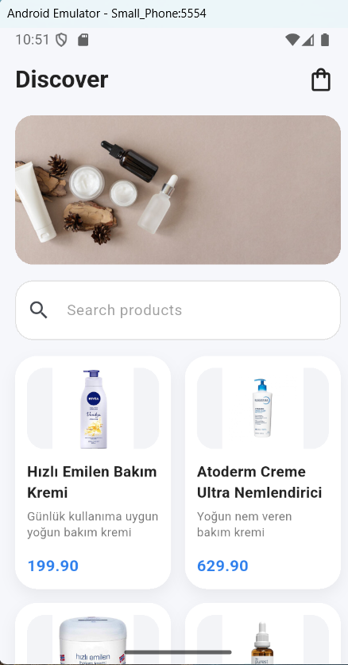
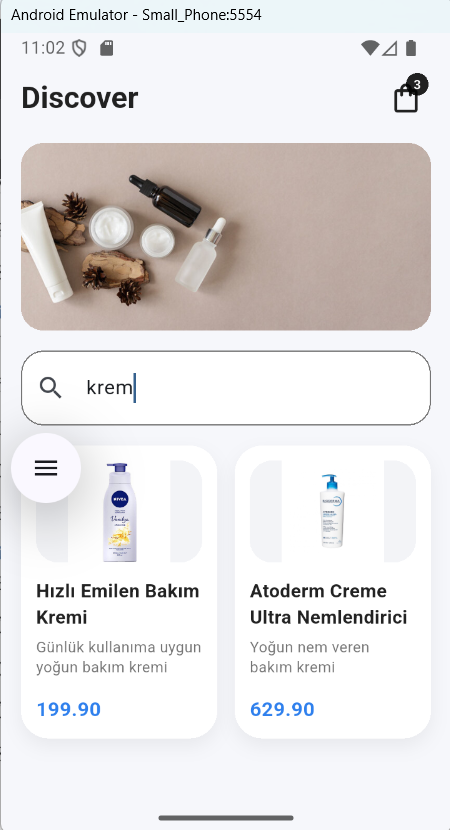
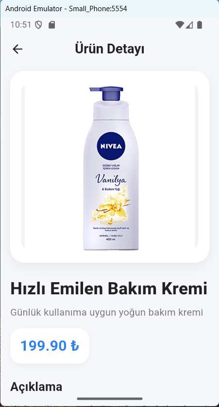
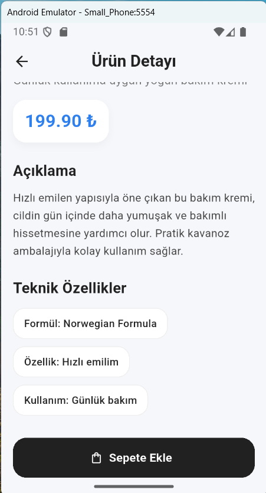
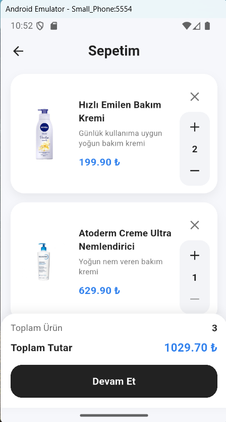
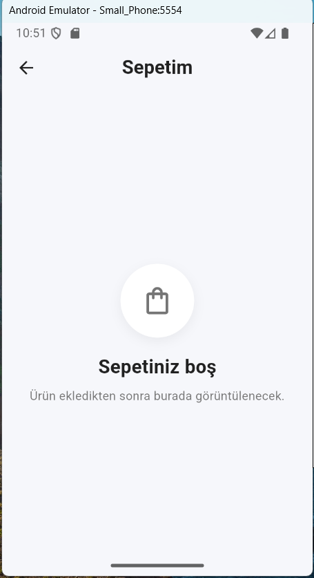

# mini-katalog-app

Bu proje, Flutter eğitimi kapsamında geliştirilmiş cilt bakım ürünleri temalı bir mini katalog uygulamasıdır.

## Proje Hakkında

Bu uygulama, temel seviyede bir mobil katalog uygulamasının yapısını göstermek amacıyla geliştirilmiştir. Projede aşağıdaki temel yapılar bulunmaktadır:

- ürün listeleme
- ürün detay sayfası
- arama ve filtreleme
- sepet simülasyonu
- adet artırma / azaltma
- yerel JSON veri kullanımı
- asset görsel yönetimi

## Özellikler

- Ana sayfada ürün kartları
- Ürün detay ekranı
- Arama ve filtreleme özelliği
- Sepet ekranı
- Sepete ürün ekleme simülasyonu
- Ürün adedini artırma / azaltma
- Sepetten ürün silme
- Boş sepet görünümü
- Toplam ürün sayısı ve toplam tutar gösterimi
- Yerel JSON ve yerel asset görsellerle çalışma

## Kullanılan Teknolojiler

- Flutter
- Dart
- Material Design

## Flutter Sürümü

- Flutter 3.41.2
- Dart 3.11.0
## Ekran Görüntüleri

### Ana Ekran

### Arama Ekranı

### Ürün Detay Ekranı

### Ürün Detay Devam Ekranı

### Sepet Ekranı

### Boş Sepet Ekranı

## Proje Klasör Yapısı

mini-katalog-app/
│
├── android/
├── ios/
├── lib/
│   ├── models/
│   │   └── product.dart
│   ├── screens/
│   │   ├── cart_screen.dart
│   │   ├── home_screen.dart
│   │   └── product_detail_screen.dart
│   ├── services/
│   │   └── product_service.dart
│   ├── widgets/
│   └── main.dart
│
├── assets/
│   ├── data/
│   │   └── products.json
│   └── images/
│       ├── banner.jpg
│       ├── product1.jpg
│       ├── product2.jpg
│       ├── product3.jpg
│       ├── product4.jpg
│       ├── product5.jpg
│       └── product6.jpg
│
├── screenshots/
│   ├── home.png
│   ├── search.png
│   ├── detail1.png
│   ├── detail2.png
│   ├── card.png
│   └── empty_card.png
│
├── test/
│   └── widget_test.dart
│
├── web/
├── windows/
├── linux/
├── macos/
├── pubspec.yaml
├── pubspec.lock
└── README.md
